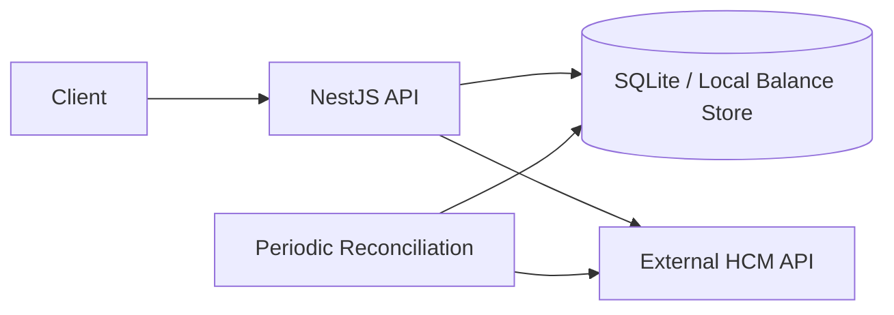

# Distributed Balance Reconciler

A backend service that keeps employee time-off balances consistent between a local application and an external Human Capital Management (HCM) system.

Built with NestJS, TypeScript, SQLite, and TypeORM. The project focuses on synchronization correctness, concurrency safety, external-service failures, and testable recovery behavior.

## Why This Exists

An employee’s balance can change outside the application—for example, through manual HR adjustments or anniversary grants. A local cache alone can become stale, while relying entirely on the external HCM would make reads slower and less resilient.

This service provides fast local reads while treating the HCM as the source of truth.

## System Design



### Core Flow

1. **Read balance** — Serve the current balance from the local database.
2. **Submit time-off request** — Validate eligibility locally, then synchronously confirm the request with the HCM.
3. **Reconcile** — Periodically fetch HCM balances and resolve drift in favor of the HCM source of truth.

## Key Engineering Decisions

### Optimistic Concurrency Control

A user request and a background reconciliation job can update the same balance concurrently. Each balance record includes a version or timestamp, preventing stale writes from overwriting newer state.

### Double-Gate Validation

The service validates a request locally for fast user feedback, then relies on the HCM response as the final approval authority. This avoids approving requests based on stale cached state.

### Recovery from Balance Drift

The reconciliation process compares local and HCM balances. When they differ, the HCM value wins, which handles external updates such as manual HR changes.

### External Dependency Failures

The system treats HCM availability and response correctness as failure modes. Tests simulate HCM downtime and inconsistent responses to verify that the service fails safely.

## Tech Stack

| Area | Technology |
| --- | --- |
| Backend | NestJS, TypeScript |
| Persistence | SQLite, TypeORM |
| External integration | Mock HCM service |
| Testing | Jest unit, integration, end-to-end, and resilience tests |
| Development approach | AI-assisted development with human-reviewed design, code, and tests |

## Testing

The test suite includes **52 tests** across the following layers:

- **Unit tests** — Balance calculations and validation logic.
- **Integration tests** — API and database behavior.
- **End-to-end tests** — Full flows between the application and mock HCM.
- **Resilience tests** — HCM downtime and balance-drift scenarios.

```bash
npm run test:cov
npm run test:unit
npm run test:integration
npm run test:resilience
```

## Run Locally

**Prerequisites:** Node.js 18+

```bash
git clone https://github.com/chengke2442/distributed-balance-reconciler.git
cd distributed-balance-reconciler
npm install
cp .env.example .env
```

Start the mock HCM service:

```bash
npm run start:hcm-mock
```

In a second terminal, start the application:

```bash
npm run start:dev
```

## Try the API

```bash
# Seed a balance
curl -X POST http://localhost:3000/sync/realtime \
  -H "Content-Type: application/json" \
  -d "{\"employeeId\":\"emp-001\",\"locationId\":\"loc-us-pto\",\"balanceDays\":10,\"hcmTimestamp\":\"2026-01-01T00:00:00Z\"}"

# Check a balance
curl http://localhost:3000/balances/emp-001/loc-us-pto

# Submit a time-off request
curl -X POST http://localhost:3000/requests \
  -H "Content-Type: application/json" \
  -d '{"employeeId":"emp-001","locationId":"loc-us-pto","daysRequested":3}'

# Trigger reconciliation
curl -X POST http://localhost:3000/sync/batch
```
